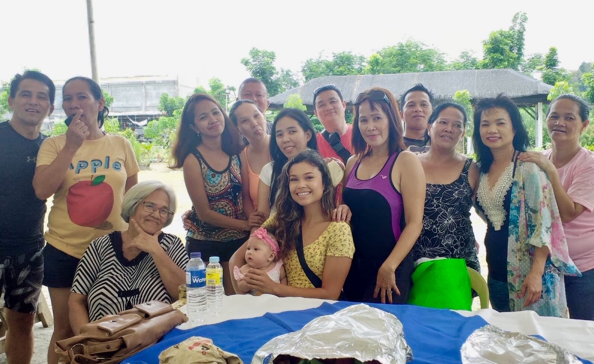

```{r setup, include=FALSE}
knitr::opts_chunk$set(echo = FALSE)
```


In her most recent position, Sam worked for the National Park Service at Point Reyes National Seashore and Golden Gate National Recreation Area, monitoring endangered coho salmon and steelhead trout. In this photo, she is a sample for water quality measurements. 


In her free time, Sam enjoys scuba diving and holds a PADI Advanced Open Water Certification. 


Sam is Filipino-American and travels to the Philippines to visit family when she has the opportunity.